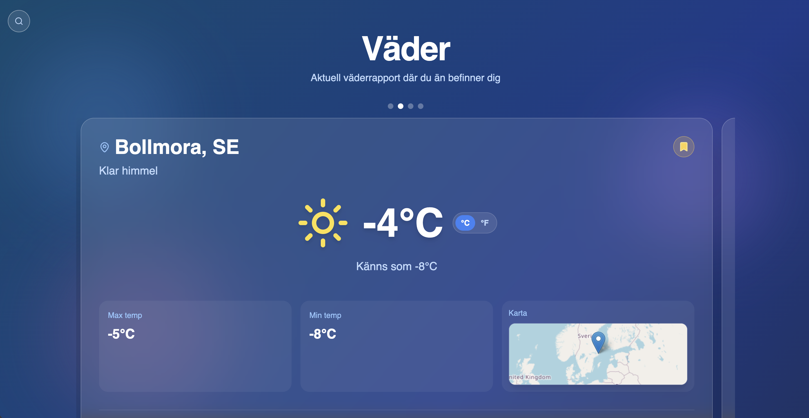

# WeatherApp

A simple weather dashboard built with React + Vite. It shows current conditions, a short forecast,
and lets you save a few favorite locations.

## Features
- Current location weather with geolocation fallback.
- Search with suggestions powered by OpenWeather geocoding.
- Saved places carousel and quick switching.
- Mini map preview for the active location.
- Unit toggle between °C and °F.

## Tech Stack
- React + Vite
- Tailwind CSS
- OpenWeather API

## Getting Started
1) Install dependencies:
```bash
npm install
```

2) Create a `.env` file and add your API key:
```bash
VITE_OPENWEATHER_API_KEY=your_key_here
```

3) Run the dev server:
```bash
npm run dev
```

## Notes
- Saved places and the last active place are stored in `localStorage`.

## Screenshots

